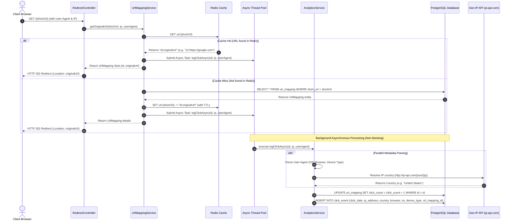
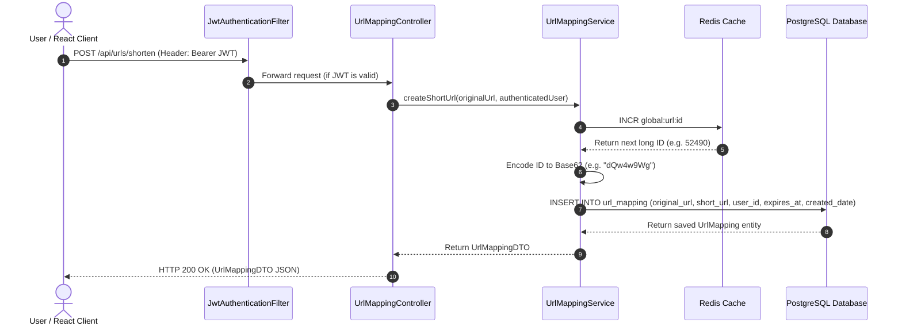

# System Design & Workflow Diagram

This document presents the detailed architectural design and workflows of the optimized, high-scale URL Shortener platform. 

---

## 🏗️ High-Level System Architecture

The system is designed for high-concurrency redirection, separating the read/redirect path (critical path) from the analytics ingestion path (non-critical path) using asynchronous workers.

```mermaid
graph TD
    Client[Client Browser]
    
    subgraph Frontend [Presentation Layer]
        ReactApp[React SPA - Vite]
    end
    
    subgraph Backend [Application Layer (Spring Boot)]
        SecFilter[Spring Security JWT Filter]
        RedirectController[Redirect Controller]
        UrlController[URL Mapping Controller]
        
        subgraph CoreServices [Core Application Logic]
            UrlMappingService[UrlMapping Service]
            AsyncPool[Async Task Executor - Thread Pool]
            AnalyticsService[Analytics Service]
        end
    end
    
    subgraph Caching [Caching Layer]
        Redis[(Redis Cache)]
    end
    
    subgraph Storage [Database Layer]
        PostgreSQL[(PostgreSQL Database)]
    end
    
    subgraph External [External Services]
        IpApi[Geo-IP REST API - ip-api.com]
    end

    %% Redirection Traffic
    Client -->|1. GET /slug| RedirectController
    RedirectController -->|2. Get original URL| UrlMappingService
    UrlMappingService -->|3. Check cache| Redis
    UrlMappingService -->|4. If Cache Miss: Query DB| PostgreSQL
    UrlMappingService -->|5. Hand off analytics| AsyncPool
    AsyncPool -->|6. Run background task| AnalyticsService
    AnalyticsService -->|7. Parse Geo-IP| IpApi
    AnalyticsService -->|8. Save ClickEvent & Increment clicks| PostgreSQL
    RedirectController -->|9. HTTP 302 Redirect| Client

    %% Link Creation Traffic
    ReactApp -->|POST /api/urls/shorten| SecFilter
    SecFilter -->|Authenticated request| UrlController
    UrlController -->|Create shortened URL| UrlMappingService
    UrlMappingService -->|Increment Global ID| Redis
    UrlMappingService -->|Save new link mapping| PostgreSQL
    UrlController -->|Return Shortened Link| ReactApp
```

---

## ⚡ Redirection Workflow (HTTP 302 Redirect)

This sequence diagram illustrates how redirection requests are served in sub-milliseconds by leveraging a pure cache-hit redirect strategy and offloading database writes to background threads.



---

## 🔗 URL Shortening Workflow

This flow shows how new short URLs are created securely using a centralized Redis ID generator.



---

## 💾 Database Schema with Performance Indexes

Database indexes ensure lookups do not perform full table scans as the dataset grows.

```
                  url_mapping (Table)
  +-----------------+---------------------------+----------------+
  | Column Name     | Type                      | Constraints    |
  +-----------------+---------------------------+----------------+
  | id              | BIGINT (PK)               | AUTO_INCREMENT |
  | original_url    | VARCHAR                   | NOT NULL       |
  | short_url       | VARCHAR                   | UNIQUE         |
  | click_count     | INTEGER                   | DEFAULT 0      |
  | created_date    | TIMESTAMP                 |                |
  | expires_at      | TIMESTAMP                 |                |
  | user_id         | BIGINT (FK)               | REFERENCES users|
  +-----------------+---------------------------+----------------+
  INDEXES:
  - idx_url_mapping_short_url ON (short_url) [Unique Hash/B-Tree]
  - idx_url_mapping_user_id ON (user_id) [B-Tree]

                  click_event (Table)
  +-----------------+---------------------------+----------------+
  | Column Name     | Type                      | Constraints    |
  +-----------------+---------------------------+----------------+
  | id              | BIGINT (PK)               | AUTO_INCREMENT |
  | click_date      | TIMESTAMP                 |                |
  | ip_address      | VARCHAR                   |                |
  | country         | VARCHAR                   |                |
  | browser         | VARCHAR                   |                |
  | os              | VARCHAR                   |                |
  | device_type     | VARCHAR                   |                |
  | url_mapping_id  | BIGINT (FK)               | REFERENCES...  |
  +-----------------+---------------------------+----------------+
  INDEXES:
  - idx_click_event_mapping_date ON (url_mapping_id, click_date)
```

---

## 📈 Scalability Highlights

1. **Pure Cache Redirection**:Redirection requests resolve directly from memory (Redis) under 1ms. The SQL database is only hit if a link has never been cached.
2. **Direct Atomic DB Increments**: Instead of retrieving an entity, altering its property in memory, and updating it back (which triggers entity dirty-checking and row locks), we execute a direct SQL statement: `UPDATE url_mapping SET click_count = click_count + 1 WHERE id = ?`.
3. **Database Indexing**: Search complexity is reduced from $O(N)$ (table scans) to $O(\log N)$ (index lookups) for URLs and click analytics queries.
4. **Asynchronous Thread Isolation**: Click logging and user metadata parsing are processed out-of-band by a Spring Task Executor thread pool, preventing user-facing HTTP request threads from waiting on third-party API and database write times.
